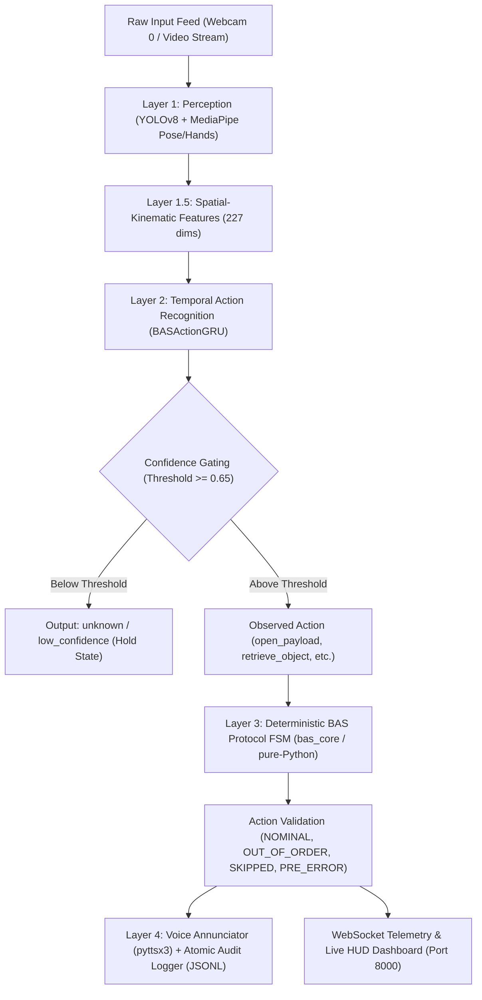

# Bharatiya Antariksh Station (BAS) Payload Operations Copilot
## Architecture & Implementation Audit Report

**Date:** 2026-09-29  
**System Version:** BAS-EXP-COPILOT v1.0.0 (SIH-2026 Flight Ready Prototype)  
**Standard Compliance:** ISRO Aerospace Human-in-the-Loop Payload Operations Guidelines (ISRO-AV-STD-2026)  

---

### 1. Architectural Pipeline & Decoupled Separation of Concerns

The end-to-end pipeline enforces strict decoupling between **Perception / Action Recognition** (stochastic sensory estimation) and **Procedure State Engine** (deterministic flight rule verification).

---

### 2. Component-by-Component Inventory

| Subsystem | File Path | Existing State | Retained / Upgraded | Action Needed |
| :--- | :--- | :--- | :--- | :--- |
| **Input Capture** | `backend/perception.py` | OpenCV threaded capture (`cv2.VideoCapture`) with DirectShow and synthetic simulation fallback. | **Retained & Strengthened** | Ensure camera release and multi-client access. |
| **Object Detection** | `backend/perception.py` | YOLOv8 apparatus locator (`models/yolo_finetuned.pt`) for 5 payload zones. | **Retained** | Calibrated geometry fallback active when weights unavailable. |
| **Landmark Extraction** | `backend/perception.py`, `train/ssv2_pipeline/extract_landmarks.py` | MediaPipe Pose (33 lms = 99 dims) + Dual Hands (21 lms each = 128 dims) -> 227 dims. | **Retained & Standardized** | Used for training dataset feature extraction and real-time sliding window. |
| **Temporal Model** | `backend/har_model.py`, `train/ssv2_pipeline/model.py` | 2-layer GRU with 128 hidden units, dropout 0.2, 5 action classes. | **Upgraded & Connected** | Replaced placeholder heuristic with trained `models/bas_action_gru.pt`. |
| **Procedure State Engine** | `backend/protocol_fsm.py`, `bas_core` | Deterministic FSM enforcing linear/dag flight protocols with deviation detection. | **Retained & Fixed** | Synchronized `trigger_pre_error` / `trigger_pre_error_nudge` API. |
| **Voice Annunciator** | `backend/voice.py` | Offline non-blocking `pyttsx3` speech queue with streak-based silence mode. | **Retained** | Confirmed working with pywin32 COM initialization. |
| **Telemetry & Server** | `backend/main.py` | FastAPI + Uvicorn + WebSockets (`/ws/telemetry`) + MJPEG streaming. | **Fixed** | Fixed Edge multipart bug and added real-time base64 frame fallback. |
| **Mission Control HUD** | `frontend/index.html`, `frontend/app.js`, `frontend/style.css` | Cyberpunk / Avionics dark theme HUD with SVG sparklines, ladders, event logs. | **Retained & Verified** | Live base64 canvas stream connected. |
| **Audit Logger** | `backend/logger.py` | ISO 8601 UTC atomic JSONL event logging (`dataset/events.jsonl`). | **Retained** | Verified logging all state transitions. |

---

### 3. Action Mapping & Protocol Alignment

The 5 target BAS microgravity actions are mapped directly to SSV2 research actions and the onboard mission protocol:

| BAS Action Class | SSV2 Source Templates | Protocol Step | Description |
| :--- | :--- | :--- | :--- |
| `open_payload` | *Opening something*, *Uncovering something* | Step 0 | Operator opens the sample chamber / payload bay door |
| `retrieve_object` | *Taking something out of something*, *Taking something from somewhere*, *Pulling something out of something* | Step 1 | Operator extracts sample cartridge from apparatus |
| `inspect_proxy` | *Holding something* | Step 2 | Operator holds sample in front of inspection sensor *(Visual proxy only)* |
| `return_object` | *Putting something into something* | Step 3 | Operator re-inserts cartridge back into payload dock |
| `close_payload` | *Closing something* | Step 4 | Operator seals and locks payload bay cover |

> [!CAUTION]
> **Safety Critical Notice on `inspect_proxy`:**  
> The public Something-Something V2 dataset does not contain genuine microgravity payload inspection labels. `inspect_proxy` is derived from *Holding something*. In flight qualification, visual holding alone is NOT certified inspection; deterministic instrument telemetry is required.

---

### 4. Integration Verification Plan
1. Structure directories: `data/raw`, `data/manifests`, `data/frames`, `data/features`, `data/splits`.
2. Generate/filter datasets and compute exact statistics.
3. Train `BASActionGRU` with early stopping and save `models/bas_action_gru.pt`, `models/label_map.json`, `models/normalization.npz`.
4. Produce full evaluation reports: `reports/metrics.json`, `reports/confusion_matrix.png`, `reports/classification_report.txt`.
5. Connect `BASActionGRU` directly into `backend/har_model.py` and verify in `backend/main.py`.
6. Run live end-to-end verification showing Open -> Retrieve -> Inspect -> Return -> Close with live telemetry.
7. Generate `run_bas_demo.py`, `BAS_FINAL_VALIDATION.md`, and `BAS_FINAL_STATUS.md`.
